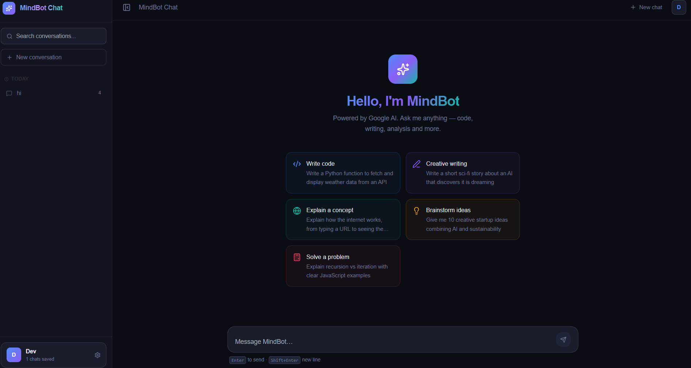

<div align="center">

# 🤖 MindBot Chat

An AI-powered full-stack chatbot built with **React, Node.js, Express, MongoDB, Redis, and Docker**, powered by Google Gemini with optional OpenAI support.

MindBot provides authenticated and guest chat, document-based **RAG**, cross-session conversation memory, multi-model AI routing, token and cost tracking, rate limiting, and an automated AI evaluation system.

[](LICENSE)
[](https://nodejs.org)
[](https://react.dev)
[](https://tailwindcss.com)
[](https://ai.google.dev)
[](https://mongodb.com)
[](https://docker.com)

---



</div>

---

### ✨ Key Features

* 🤖 **AI Chat** — Gemini-powered conversational AI with streaming responses
* 🔐 **Authentication** — JWT authentication with secure httpOnly cookies
* 👤 **Guest Mode** — Limited server-enforced free trial
* 🔄 **Multi-Model AI** — Gemini and optional OpenAI provider abstraction
* 📄 **RAG** — Upload PDF, DOCX, and TXT documents and ask questions about them
* 🧠 **Conversation Memory** — Stores and recalls useful information across sessions
* 💰 **Token & Cost Tracking** — Tracks AI usage, latency, and estimated costs
* ⚡ **Redis** — Rate limiting and caching with an in-memory fallback
* 🛡️ **Security** — Zod validation, bcrypt, JWT, rate limiting, and centralized error handling
* 📊 **AI Evaluation** — Automated LLM-based evaluation with CI-friendly pass/fail thresholds
* 📚 **Swagger/OpenAPI** — Interactive API documentation
* 🐳 **Docker** — Containerized frontend, backend, and Redis services

### 🛠️ Tech Stack

**Frontend:** React, Vite, Tailwind CSS

**Backend:** Node.js, Express

**Database:** MongoDB, Mongoose

**AI:** Google Gemini, OpenAI

**Cache:** Redis

**Authentication:** JWT, bcrypt, httpOnly Cookies

**Validation:** Zod

**Logging:** Pino

**Documentation:** Swagger / OpenAPI

**DevOps:** Docker, Docker Compose

### 🏗️ Architecture

```text
React + Vite
     │
     ▼
Express API
     │
     ├── Authentication
     ├── Chat & Sessions
     ├── RAG / Documents
     ├── Conversation Memory
     ├── Usage Tracking
     └── Rate Limiting
             │
       ┌─────┴─────┐
       ▼           ▼
   MongoDB       Redis
       
     AI Router
     ┌────┴────┐
     ▼         ▼
  Gemini     OpenAI
```

### 🚀 Running with Docker

```bash
docker compose up -d --build
```

The application runs the frontend, backend, and Redis services in Docker containers.

### 📖 API Documentation

Once the server is running:

```text
http://localhost:5000/api/docs
```

### 📌 Project Focus

MindBot was developed to explore **AI engineering, RAG pipelines, multi-model architectures, backend scalability, authentication, observability, and production-oriented deployment practices**.

### 📄 License

Licensed under the **MIT License** — see [LICENSE](LICENSE) for details.
